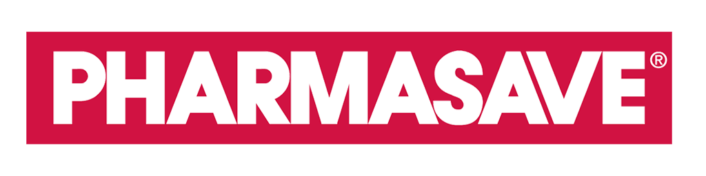

    

***

    
    
    

    
    
    
    
    

    
    

A web application to help the Carriage Crossing Pharmacy coordinate pickups and appointments during the CoronaVirus pandemic.

## Background and Scope ##
Source: <i>Project Requirements Document</i>  
Carriage Crossing Pharmacy is a community pharmacy in Waterloo at the heat of the Carriage Crossing Community. 
 
Because of COVID-19, people have been advised to stay home and social distance. As a result, shoppers are advised to call the store to check availability and arrange for pickup or dilivery. Carriage Crossing Pharmacy is looking for an automated solution to improve its customer services and better help their customers through this difficult time.

### Basic Requirements ###
1.  Coordinate customer pickup time to maintain social distancing
2.  Enables users to selet pick up/delivery options (parking lot drop off, delivery, or in store)
3.  Facilitates various payment options (credit card, e-transfer)

### Optional Requirements ###
1.  Allows shoppers to check product availability and order online
2.  Assist the pharmacy in preparing items on shopper's list
3.  Maintain a FAQs page to answer shoppers' questions
4.  Develop a product category database and a front-end query to help customers self serve 

Students can use a wide range of applications such as Google Forms, SQL, PHP, etc. 

### Each team is suggested to have ###
1.  One <b>Project Manager/Scrum master</b> to manage the deliverables
2.  One or Two <b>Pharmacy Assistants</b> to understand the business and facilitate the implementation
3.  One of Two <b>Developers/Data Engineers</b> to develop the application/database and perform QA 
 
Students are encouraged to take on multiple roles in a team.

### Length of Project ###
Presentation Date: May 23, 2020